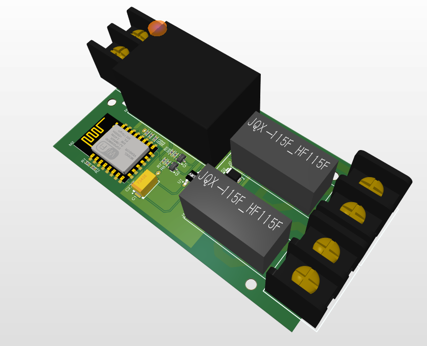
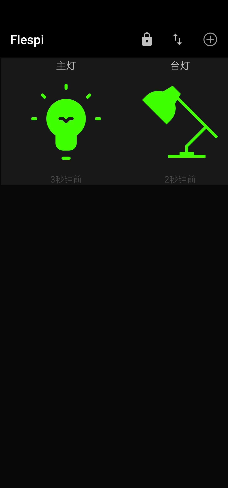

# ESP8266 MQTT

## 特性:

1. MQTT 协议远程控制, 连接MQTT Broker, 无论在哪里都可以控制.
2. 两路继电器控制市电220V负载, 最大可控制 8A 电流.
3. 内置 220V 转 5V 1200mA 超稳定降压模块.
4. ESP 12F模块作为控制中心, 内置http server用于配置用户设定:
   - WiFi SSID
   - WiFi Password
   - MQTT Broker Host
   - MQTT Broker Port
   - MQTT Broker URI
   - MQTT Broker Username
   - MQTT Broker Password

5. 设置掉电不丢失
6. 快速上电掉电3次(每次控制在3S内), 恢复默认设置
7. 手机控制






## 使用教程
1. MQTT TOPIC: 
   - /topic/esp8266/esp-12f/mac/../gpio/16
   - /topic/esp8266/esp-12f/mac/../gpio/14
   - /topic/esp8266/esp-12f/mac/../gpio/12
   - /topic/esp8266/esp-12f/mac/../gpio/13
   - /topic/esp8266/esp-12f/mac/../chip_info
其中mac通过访问web服务器首页中的 Chip Info 链接查看

2. MQTT 通信数据格式是JSON格式, 可以设置亮度(0~100). 有两种方式:
   - 固定格式:
     {"mqtt_dashboard":{"brightness":<value>,"color": <value>}}
   - 简单格式:
     直接设置亮度数值.

只要是支持MQTT标准通信协议(v3.3.1)的控制端都可以通过订阅相关topic, 发布数据到相应的topic进行控制.


## 烧录镜像
1. 首先烧录存储分区镜像文件, 大小为512KByte, 此文件由文件夹esp-html生成, 推荐使用 mkspifs生成, 使用命令:
```bash
mkspiffs -c esp-html/ -a -s 524288 ./spiffs_v1.bin
```
镜像生成后烧录偏移地址为 0x200000

2. 之后正常编译整个工程默认烧录即可
